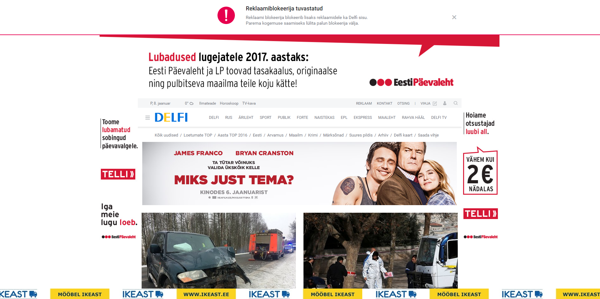

# PEALKIRI


Nimi

## Eesmärk
blabla

## Kirjeldus
* Sihtrühm:
	* Vanus: 20-75+
	

|||
|-------|----|
|| |


## Andmebaasi skeem ja tabelite loomise SQL laused


```
create database workman;
use workman;

create table types (
type varchar(30) unique not null primary key
);
```

* Kokkuvõte: mida õppisid juurde? mis ebaõnnestus? mis oli keeruline?
	* bla
	
